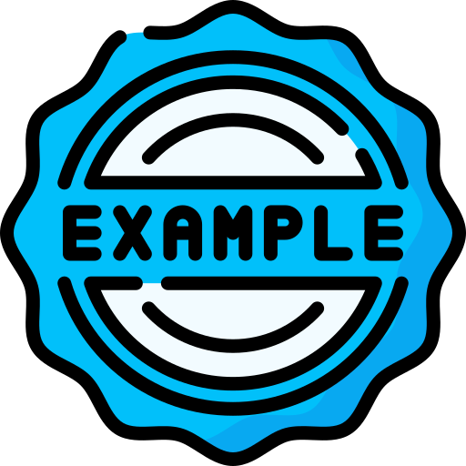

# daweb2526-ud01-markdown-acs

Encabezados: 

# Esto es H1

## Esto es H2

### Esto es H3

#### Esto es H4

Enfasis:

*italica*

**negrita**

~~tachado~~

Listas desordenadas:

- Item 1
- Item 2
  - Subitem 2.1

Listas ordenadas:

1. Primer paso
2. Segundo paso

Links e imagenes:

[Esto va a ser un enlace](https://iesalixar.org)




Citar: 

>Esto es una cita

Escribir codigo:

`System.out.println("Hola mundo");`

```java
public class Hola {
  public static void main(String[] args)
}
  System.out.println("Hola Mundo");
  }
}
```

Tablas:

| Nombre | Edad | Ciudad   |
|:-------|----:|:----------|
| Ana    |  25 | Granada   |
| Juan   |  30 | Jaén      |

(Alineación: :--- izquierda, ---: derecha, :---: centro.)
